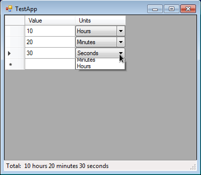

DETools
=========================

Tools for a binding the beautiful title of enumeration value to the DataGridView Combobox: `[Enum.Value] <--> [Enum.Description] <--> [DataGridView Combobox Column]`. 
Compartible with DataSource from custom object (sample in TestApp) and database. 
 
You can to easy transform column of your DataGridView to Combobox just in one line, like a: `DETools.DataGridViewHelper.ReplaceWithDropDownColumn(dataGridView1, "Units", "Units", typeof(TimeUnits));`

